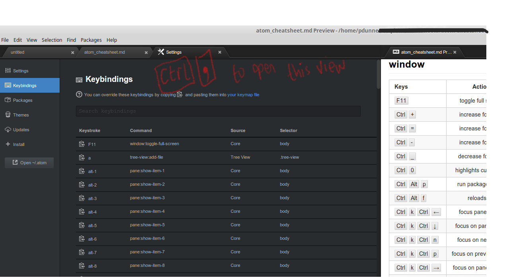
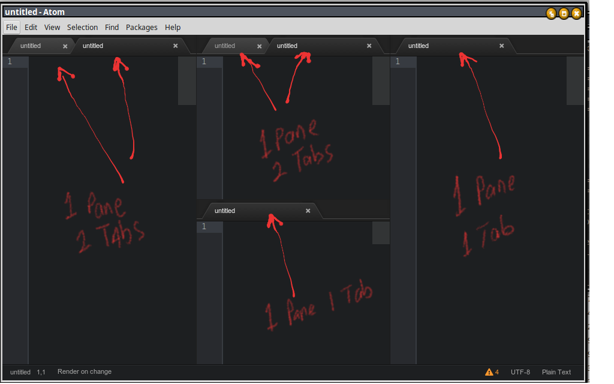

Atom Cheat-sheet (Linux version).
=================================

<a rel="license" href="http://creativecommons.org/licenses/by-sa/4.0/"></a><br /><span xmlns:dct="http://purl.org/dc/terms/" property="dct:title">Atom Cheatsheet</span> by <span xmlns:cc="http://creativecommons.org/ns#" property="cc:attributionName">Paul Dunne</span> is licensed under a <a rel="license" href="http://creativecommons.org/licenses/by-sa/4.0/">Creative Commons Attribution-ShareAlike 4.0 International License</a>.

I created this as a printable version of **Jesse Kasky's** excellent **atom-keybinding-cheatsheet** [Github Key Binding Cheatsheet Package](https://github.com/jkasky/atom-keybinding-cheatsheet). As I go I'm expanding it with my own notes.

Cheat-sheet Source Code: https://github.com/pd-gmit/atom-cheatsheet.git

<!---
My first iteration I was using keyboard images .. but then switched to
to the keyboard tag: <kbd> </kbd>
Here is some of the original source for this cheat sheet for reference:
Open the command palette (ctrl-shift-p)     


-->

Atom concept notes
------------------

### starting atom

-	You can start Atom from the command line (and it will start and open all the files in that folder). The files will be visible in the "folder view" in the file view panel.

### folders and files

-	When Atom starts you can toggle the "file/folder view pane" by pressing the <kbd>Ctrl</kbd> and <kbd>&#92;</kbd> simultaneously. This shortcut is often simply written in the documentation as Ctrl-\\

-	Alternatively you can display a list of files (in the folder in question) by typing <kbd>Ctrl</kbd> <kbd>t</kbd>. This cause a drop-down menu to appear. Simply select the file you require from the drop-down selection panel to open it in the editor.

-	Each folder you open in Atom starts a new instance of Atom. This new instance will display the folder contents in a new "tree view" in that Atom instance.

### shortcut keys

-	A full listing of "shortcut keys" are listed in this cheat sheet. Please note that the Shift key is often labeled on the keyboard as <kbd> &#8679;</kbd>

### user settings

-	General Atom settings can be seen by typing the <kbd>Ctrl</kbd> <kbd>,</kbd> combination. "Keybindings" is one of the options available. It shows the mapping between keys combinations and the action they perform. 

-	Packages shows the currently installed packages (including ones that the user has installed themselves).

-	Themes show the installed themes - more can be added by the user.

-	Install is a useful option here. It lets you search for (add-on) packages that are available from the community. This includes "markdown-toc", which will insert a table of contents in your markdown etc.

### the command palette

-	The "Command Pallet" is a useful drop-down dialog that lists Atom commands. You can run any "command" by selecting it in the drop down menu. To see the commands (and key bindings) that are relevant to the currently focused GUI interface element press <kbd>Ctrl</kbd> <kbd>Shift</kbd> <kbd>p</kbd>

### editor pane

-	When you're in an editor "pane" you can create a new file by selecting the menu item File|New File or else type <kbd>Ctrl</kbd> <kbd>n</kbd> and a new tab will be created in that pane for your new file.
-	A "pane" can contain multiple tabs.
-	You can show "Whitespace" in the editor by going to FILE > SETTINGS [RHS PANE] select/tick SHOW INVISIBLES. 
-	The "Command Pallet" dialog gives you commands "to split a pane in two" and more. Press <kbd>Ctrl</kbd> <kbd>Shift</kbd> <kbd>p</kbd> simultaneously and then type "pane" in the dialog to get a list of pane related commands.
-	A useful plugin for working with panes is the "**resize-panes**" package. Unfortunately it doesn't work initially (it has Mac key bindings). Its fixable by editing the configuration file`~/.atom/packages/resize-panes/keymaps/resize-panes.cson` and appending the following to the file.

```
 .platform-win32, .platform-linux':
 'ctrl-alt-=': 'resize-panes:enlarge-active-pane'
 'ctrl-alt--': 'resize-panes:shrink-active-pane'
```



### editing files

-	You can correct spellings by selecting the misspelled word and pressing the <kbd>Ctrl</kbd> <kbd>:</kbd> keys. Choose the correct spelling from the pop up dialog that appears.

-	You can select several sequential | non-sequential lines in a file by pressing <kbd>Ctrl</kbd> and then **Mouse-Left-Click** the line(s) you want to select. A blinking cursor will appear at each selected point in the file. You can now write to them (or edit them) all simultaneously! Press <kbd>Esc</kbd> to stop simultaneous editing.

### install additional packages and themes

Open **File** > **Settings**  and then click/select **+ Install** . In the _Search Packages_ box that appears simply type the name of the package/theme you wish to install.


### keeping track of your installed packages

-	For a *detailed* list of **all** installed packages (show in a directory tree like format) type `apm list` on the command line.
-	For a *simple* list of packages that **you installed** type `apm list --installed --bare` on the command line.

### over-type mode

A plugin exists that allows you "overtype" (type and replace/over-write existing text) its called **atom-overtype-mode**. The <kbd>Insert</kbd> key does not work without this plugin.


window
------

| Keys                                                             | Action                      | Comment                   |
|:-----------------------------------------------------------------|:----------------------------|:--------------------------|
| <kbd>F11</kbd>                                                   | toggle full screen          |                           |
| <kbd>Ctrl</kbd> <kbd> + </kbd>                                   | increase font size          |                           |
| <kbd>Ctrl</kbd> <kbd> = </kbd>                                   | increase font size          |                           |
| <kbd>Ctrl</kbd> <kbd> - </kbd                                    | decrease                    |                           |
| <kbd>Ctrl</kbd> <kbd> _ </kbd                                    | decrease font size          |                           |
| <kbd>Ctrl</kbd> <kbd>0</kbd>                                     | highlights current file     |                           |
| <kbd>Ctrl</kbd> <kbd>Alt</kbd> <kbd>p</kbd>                      | run package specs           | opens a spec suite window |
| <Ctrl</kbd> <kbd>Alt</kbd> <kbd>f</kbd>                          | reloads file                |                           |
| <kbd>Ctrl</kbd> <kbd>k</kbd> <kbd>Ctrl</kbd> <kbd>&#8592; </kbd> | focus pane on left          |                           |
| <kbd>Ctrl</kbd> <kbd>k</kbd> <kbd>Ctrl</kbd> <kbd>&#8595; </kbd> | focus on pane below         |                           |
| <kbd>Ctrl</kbd> <kbd>k</kbd> <kbd>Ctrl</kbd> <kbd>n</kbd>        | move focus to next pane     |                           |
| <kbd>Ctrl</kbd> <kbd>k</kbd> <kbd>Ctrl</kbd> <kbd>p</kbd>        | move focus to previous pane |                           |
| <kbd>Ctrl</kbd> <kbd>k</kbd> <kbd>Ctrl</kbd> <kbd>&#8594;</kbd>  | move focus to pane on right |                           |
| <kbd>Ctrl</kbd> <kbd>k</kbd> <kbd>Ctrl</kbd> <kbd>&#8593;</kbd>  | move focus to pane above    |                           |
| <kbd>Ctrl</kbd> <kbd>Shift</kbd> <kbd>l</kbd>                    | toggle dev tools            |                           |
| <kbd>Ctrl</kbd> <kbd>Shift</kbd> <kbd>W</kbd>                    | close window                |                           |

tree-view
---------

(NB: tree view must be open and selected for these commands to succeed)

| Keys                                                      | Action                                     |
|:----------------------------------------------------------|:-------------------------------------------|
| <kbd>a</kbd>                                              | pops add a new file dialog                 |
| <kbd>Alt</kbd> <kbd>&#8592; </kbd>                        | recursive collapse directory               |
| <kbd>Alt</kbd> <kbd>&#8594; </kbd>                        | recursive expand directory                 |
| <kbd>backspace</kbd>                                      | delete/remove selected file                |
| <kbd>Ctrl</kbd> <kbd>0</kbd>                              | toggle focus                               |
| <kbd>Ctrl</kbd> <kbd>1</kbd>                              | open selected entry in pane 1              |
| <kbd>Ctrl</kbd> <kbd>2</kbd>                              | open selected entry in pane 2              |
| <kbd>Ctrl</kbd> <kbd>3</kbd>                              | open selected entry in pane 3              |
| <kbd>Ctrl</kbd> <kbd>4</kbd>                              | open selected entry in pane 4              |
| <kbd>Ctrl</kbd> <kbd>5</kbd>                              | open selected entry in pane 5              |
| <kbd>Ctrl</kbd> <kbd>6</kbd>                              | open selected entry in pane 6              |
| <kbd>Ctrl</kbd> <kbd>7</kbd>                              | open selected entry in pane 7              |
| <kbd>Ctrl</kbd> <kbd>8</kbd>                              | open selected entry in pane 8              |
| <kbd>Ctrl</kbd> <kbd>9</kbd>                              | open selected entry in pane 9              |
| <kbd>Ctrl</kbd> <kbd>&#91;</kbd>                          | collapse directory                         |
| <kbd>Ctrl</kbd> <kbd>&#92;</kbd>                          | toggle tree view pane visibility           |
| <kbd>Ctrl</kbd> <kbd>k</kbd> <kbd>Ctrl</kbd> <kbd>b</kbd> | toggle tree view pane visibility           |
| <kbd>Ctrl</kbd> <kbd>Alt</kbd> <kbd>&#91;</kbd>           | recursive collapse directory               |
| <kbd>Ctrl</kbd> <kbd>Alt</kbd> <kbd>&#93;</kbd>           | recursive expand directory                 |
| <kbd>Ctrl</kbd> <kbd>c</kbd>                              | copy file                                  |
| <kbd>Ctrl</kbd> <kbd>k</kbd> <kbd>&#8595;</kbd>           | open selected file in new pane down        |
| <kbd>Ctrl</kbd> <kbd>k</kbd> <kbd>j</kbd>                 | open selected file in new pane down        |
| <kbd>Ctrl</kbd> <kbd>k</kbd> <kbd>h</kbd>                 | open selected file in new pane left        |
| <kbd>Ctrl</kbd> <kbd>k</kbd> <kbd>&#8592;</kbd>           | open selected file in new pane left        |
| <kbd>Ctrl</kbd> <kbd>k</kbd> <kbd>k</kbd>                 | open selected file in new pane up          |
| <kbd>Ctrl</kbd> <kbd>k</kbd> <kbd>&#8593;</kbd>           | open selected file in new pane up          |
| <kbd>Ctrl</kbd> <kbd>k</kbd> <kbd>l</kbd>                 | open selected file in new pane right       |
| <kbd>Ctrl</kbd> <kbd>k</kbd> <kbd>&#8594;</kbd>           | open selected file in new pane right       |
| <kbd>Ctrl</kbd> <kbd>Shift</kbd> <kbd>C</kbd>             | copy full path to file to clipboard        |
| <kbd>Ctrl</kbd> <kbd>v</kbd>                              | paste                                      |
| <kbd>Ctrl</kbd> <kbd>x</kbd>                              | cut                                        |
| <kbd>Ctrl</kbd> <kbd>&#124;</kbd>                         | reveal active file in tree view            |
| <kbd>d</kbd>                                              | duplicate active file in tree view         |
| <kbd> &#9249;</kbd>                                       | delete/remove file in tree view            |
| <kbd>Enter</kbd>                                          | open selected entry in tree view           |
| <kbd>F2</kbd>                                             | pops dialogue for new path for file        |
| <kbd>m</kbd>                                              | pops dialogue for new path for file        |
| <kbd>i</kbd>                                              | toggle vcs ignored files                   |
| <kbd>L</kbd>                                              | expand directory                           |
| <kbd>&#8594;</kbd>                                        | expand directory                           |
| <kbd>&#8592;</kbd>                                        | collapse directory                         |
| <kbd>h</kbd>                                              | collapse directory                         |
| <kbd>Shift</kbd> <kbd>A</kbd>                             | pops dialogue to enter path for new folder |

pane
----

| Keys                                                      | Action                                          |
|:----------------------------------------------------------|:------------------------------------------------|
| <kbd>Alt</kbd> <kbd>1</kbd>                               | show/switch to pane 1 or tab 1 (as appropriate) |
| <kbd>Alt</kbd> <kbd>2</kbd>                               | show/switch pane/tab 2                          |
| <kbd>Alt</kbd> <kbd>3</kbd>                               | show/switch pane/tab 3                          |
| <kbd>Alt</kbd> <kbd>4</kbd>                               | show/switch pane/tab 4                          |
| <kbd>Alt</kbd> <kbd>5</kbd>                               | show/switch pane/tab 5                          |
| <kbd>Alt</kbd> <kbd>6</kbd>                               | show/switch pane/tab 6                          |
| <kbd>Alt</kbd> <kbd>7</kbd>                               | show/switch pane/tab 7                          |
| <kbd>Alt</kbd> <kbd>8</kbd>                               | show/switch pane/tab 8                          |
| <kbd>Alt</kbd> <kbd>9</kbd>                               | show/switch pane/tab 9                          |
| <kbd>Ctrl</kbd> <kbd>k</kbd> <kbd>Ctrl</kbd> <kbd>w</kbd> | close current pane                              |
| <kbd>Ctrl</kbd> <kbd>k</kbd> <kbd>&#8595;</kbd>           | swaps current line with line below              |
| <kbd>Ctrl</kbd> <kbd>k</kbd> <kbd>&#8592; </kbd>          | moves cursor one word left                      |
| <kbd>Ctrl</kbd> <kbd>k</kbd> <kbd>&#8594; </kbd>          | moves cursor one word right                     |
| <kbd>Ctrl</kbd> <kbd>k</kbd> <kbd>&#8593; </kbd>          | swaps current line with line above              |
| <kbd>Ctrl</kbd> <kbd>PgDn</kbd>                           | show next pane/tab                              |
| <kbd>Ctrl</kbd> <kbd>PgUp</kbd>                           | show previous pane/tab                          |
| <kbd>Ctrl</kbd> <kbd>Shift</kbd> <kbd>T</kbd>             | reopens previously closed file(s) in pane/tab   |
| <kbd>Ctrl</kbd> <kbd>Shift</kbd> <kbd>PgDn</kbd>          | move item right                                 |
| <kbd>Ctrl</kbd> <kbd>Shift</kbd> <kbd>PgUp</kbd>          | move item left                                  |
| <kbd>Ctrl</kbd> <kbd>&#8633;</kbd>                        | cycles through panes/tabs forward order         |
| <kbd>Ctrl</kbd> <kbd>Shift</kbd> <kbd>&#8633;</kbd>       | cycles through panes/tabs reverse order         |

editor
------

| Keys                                                         | Action                            |
|:-------------------------------------------------------------|:---------------------------------:|
| <kbd>Alt</kbd> <kbd>h</kbd>                                  |    delete to beginning of word    |
| <kbd>Alt</kbd> <kbd>b</kbd>                                  |     move to beginning of word     |
| <kbd>Ctrl</kbd> <kbd>&#9003;</kbd>                           |    delete to beginning of word    |
| <kbd>Alt</kbd> <kbd>Shift</kbd> <kbd>B</kbd>                 |    select to beginning of word    |
| <kbd>Alt</kbd> <kbd>f</kbd>                                  |        move to end of word        |
| <kbd>Alt</kbd> <kbd>d</kbd>                                  |       delete to end of word       |
| <kbd>Ctrl</kbd> <kbd> &#9249;</kbd>                          |       delete to end of word       |
| <kbd>Alt</kbd> <kbd>Shift</kbd> <kbd>F</kbd>                 |       select to end of word       |
| <kbd>Alt</kbd> <kbd>Shift</kbd> <kbd>&#8595;</kbd>           |        add selection below        |
| <kbd>Alt</kbd> <kbd>Shift</kbd> <kbd>&#8593;</kbd>           |        add selection above        |
| <kbd>Ctrl</kbd> <kbd>/</kbd>                                 |       toggle line comments        |
| <kbd>Ctrl</kbd> <kbd> < </kbd>                               |       show settings dialog        |
| <kbd>Ctrl</kbd> <kbd>&#91;</kbd>                             |      out-dent selected rows       |
| <kbd>Ctrl</kbd> <kbd>&#93;</kbd>                             |       indent selected rows        |
| <kbd>Ctrl</kbd> <kbd>Alt</kbd> <kbd>&#91;</kbd>              |         fold current row          |
| <kbd>Ctrl</kbd> <kbd>Alt</kbd> <kbd>&#93;</kbd>              |        unfold current row         |
| <kbd>Ctrl</kbd> <kbd>Alt</kbd> <kbd>f</kbd>                  |          fold selection           |
| <kbd>Ctrl</kbd> <kbd>Alt</kbd> <kbd>Shift</kbd> <kbd>P</kbd> |         log cursor scope          |
| <kbd>Ctrl</kbd> <kbd>Alt</kbd> <kbd>z</kbd>                  |      checkout head revision       |
| <kbd>Ctrl</kbd> <kbd>Alt</kbd> <kbd>\{</kbd>                 |             fold all              |
| <kbd>Ctrl</kbd> <kbd>Alt</kbd> <kbd>\}</kbd>                 |            unfold all             |
| <kbd>Ctrl</kbd> <kbd> &#8595;</kbd>                          |          move line down           |
| <kbd>Ctrl</kbd> <kbd> Enter</kbd>                            |           newline below           |
| <kbd>Ctrl</kbd> <kbd> j </kbd>                               |            join lines             |
| <kbd>Ctrl</kbd> <kbd> K</kbd> <kbd>Ctrl</kbd> <kbd>0</kbd>   |            unfold all             |
| <kbd>Ctrl</kbd> <kbd> K</kbd> <kbd>Ctrl</kbd> <kbd>1</kbd>   |      fold at indent level 1       |
| <kbd>Ctrl</kbd> <kbd> K</kbd> <kbd>Ctrl</kbd> <kbd>2</kbd>   |      fold at indent level 2       |
| <kbd>Ctrl</kbd> <kbd> K</kbd> <kbd>Ctrl</kbd> <kbd>3</kbd>   |      fold at indent level 3       |
| <kbd>Ctrl</kbd> <kbd> K</kbd> <kbd>Ctrl</kbd> <kbd>4</kbd>   |      fold at indent level 4       |
| <kbd>Ctrl</kbd> <kbd> K</kbd> <kbd>Ctrl</kbd> <kbd>5</kbd>   |      fold at indent level 5       |
| <kbd>Ctrl</kbd> <kbd> K</kbd> <kbd>Ctrl</kbd> <kbd>6</kbd>   |      fold at indent level 6       |
| <kbd>Ctrl</kbd> <kbd> K</kbd> <kbd>Ctrl</kbd> <kbd>7</kbd>   |      fold at indent level 7       |
| <kbd>Ctrl</kbd> <kbd> K</kbd> <kbd>Ctrl</kbd> <kbd>8</kbd>   |      fold at indent level 8       |
| <kbd>Ctrl</kbd> <kbd> K</kbd> <kbd>Ctrl</kbd> <kbd>9</kbd>   |      fold at indent level 9       |
| <kbd>Ctrl</kbd> <kbd> K</kbd> <kbd>Ctrl</kbd> <kbd>l</kbd>   |            lower case             |
| <kbd>Ctrl</kbd> <kbd> K</kbd> <kbd>Ctrl</kbd> <kbd>u</kbd>   |            upper case             |
| <kbd>Ctrl</kbd> <kbd>l</kbd>                                 |            select line            |
| <kbd>Ctrl</kbd> <kbd>&#8592;</kbd>                           |     move to beginning of word     |
| <kbd>Ctrl</kbd> <kbd>&#8594;</kbd>                           |        move to end of word        |
| <kbd>Ctrl</kbd> <kbd>Shift</kbd> <kbd> C</kbd>               |             copy path             |
| <kbd>Ctrl</kbd> <kbd>Shift</kbd> <kbd> D</kbd>               |          duplicate lines          |
| <kbd>Ctrl</kbd> <kbd>Shift</kbd> <kbd> K</kbd>               |            delete line            |
| <kbd>Ctrl</kbd> <kbd>Shift</kbd> <kbd> Enter</kbd>           |           newline above           |
| <kbd>Ctrl</kbd> <kbd>Shift</kbd> <kbd> &#8592; </kbd>        |    select to beginning of word    |
| <kbd>Ctrl</kbd> <kbd>Shift</kbd> <kbd> &#8594; </kbd>        |       select to end of word       |
| <kbd>Ctrl</kbd> <kbd> &#8593; </kbd>                         |           move line up            |
| <kbd>End</kbd>                                               |    move to end of sceeen line     |
| <kbd>Enter</kbd>                                             |              newline              |
| <kbd>Esc</kbd>                                               |       consolodate selection       |
| <kbd>Home</kbd>                                              |  move to first character of line  |
| <kbd>Shift</kbd> <kbd>End</kbd>                              |       select to end of line       |
| <kbd>Shift</kbd> <kbd>Home</kbd>                             | select to first character of line |
| <kbd>Shift</kbd> <kbd>Tab</kbd>                              |       outdent selected rows       |
| <kbd>Tab</kbd>                                               |              indent               |

Notifications
=============

| Keys                                          | Action                            |
|:----------------------------------------------|:---------------------------------:|
| <kbd>Alt</kbd> <kbd>Ctrl</kbd> <kbd>Tab</kbd> | select to first character of line |

#Find and Replace

| Keys                                                      | Action                       | Comment |
|:----------------------------------------------------------|:-----------------------------|:--------|
| <kbd>Alt</kbd> <kbd>Enter</kbd>                           | find all                     |         |
| <kbd>Alt</kbd> <kbd>F3</kbd>                              | select all                   |         |
| <kbd>Ctrl</kbd> <kbd>Alt</kbd> <kbd> / </kbd>             | toggle regex option          |         |
| <kbd>Ctrl</kbd> <kbd>Alt</kbd> <kbd>c</kbd>               | toggle case option           |         |
| <kbd>Ctrl</kbd> <kbd>Alt</kbd> <kbd>f</kbd>               | show replace                 |         |
| <kbd>Ctrl</kbd> <kbd>Alt</kbd> <kbd>s</kbd>               | toggle selection option      |         |
| <kbd>Ctrl</kbd> <kbd>Alt</kbd> <kbd>w</kbd>               | toggle whole word option     |         |
| <kbd>Ctrl</kbd> <kbd>d</kbd>                              | select next                  |         |
| <kbd>Ctrl</kbd> <kbd>e</kbd>                              | use selction as find pattern |         |
| <kbd>Ctrl</kbd> <kbd>Enter</kbd>                          | confirm                      |         |
| <kbd>Ctrl</kbd> <kbd>Enter</kbd>                          | replace all                  | ??      |
| <kbd>Ctrl</kbd> <kbd>f</kbd>                              | show                         |         |
| <kbd>Ctrl</kbd> <kbd>k</kbd> <kbd>Ctrl</kbd> <kbd>d</kbd> | select skip                  |         |
| <kbd>Ctrl</kbd> <kbd>u</kbd>                              | select undo                  |         |
| <kbd>F3</kbd>                                             | find next                    |         |
| <kbd>Shift</kbd> <kbd>Enter</kbd>                         | previous show                |         |
| <kbd>Shift</kbd> <kbd>F3</kbd>                            | find previous                |         |
| <kbd>Shift</kbd> <kbd>Tab</kbd>                           | focus-previous               |         |
| <kbd>Tab</kbd>                                            | focus next                   |         |

#Open on GitHub

| Keys                                     | Action         |
|:-----------------------------------------|---------------:|
| <kbd>Alt</kbd> <kbd>g</kbd> <kbd>n</kbd> |          blame |
| <kbd>Alt</kbd> <kbd>g</kbd> <kbd>c</kbd> |       copy URL |
| <kbd>Alt</kbd> <kbd>g</kbd> <kbd>h</kbd> |        history |
| <kbd>Alt</kbd> <kbd>g</kbd> <kbd>o</kbd> |           file |
| <kbd>Alt</kbd> <kbd>g</kbd> <kbd>r</kbd> | branch compare |

#Git Diff

| Keys                                           | Action                |
|:-----------------------------------------------|----------------------:|
| <kbd>Alt</kbd> <kbd>g</kbd> <kbd>d</kbd>       |      toggle diff list |
| <kbd>Alt</kbd> <kbd>g</kbd> <kbd>&#8595;</kbd> |     move to next diff |
| <kbd>Alt</kbd> <kbd>g</kbd> <kbd>&#8593;</kbd> | move to previous diff |

#Snippets

| Keys                                         | Action            |
|:---------------------------------------------|------------------:|
| <kbd>Alt</kbd> <kbd>Shift</kbd> <kbd>S</kbd> |       "available" |
| <kbd>Shift</kbd> <kbd>Tab</kbd>              | previous tab stop |
| <kbd>Tab</kbd>                               |            expand |
| <kbd>Tab</kbd>                               |     next tab stop |

#Bookmarks

| Keys                                           | Action                    |
|:-----------------------------------------------|--------------------------:|
| <kbd>Alt</kbd> <kbd>Shift</kbd> <kbd>F2</kbd>  |           clear bookmarks |
| <kbd>Ctrl</kbd> <kbd>F2</kbd>                  |                  view all |
| <kbd>Ctrl</kbd> <kbd>Shift</kbd> <kbd>F2</kbd> |          toggle bookmarks |
| <kbd>F2</kbd>                                  |     jump to next bookmark |
| <kbd>Shift</kbd> <kbd>F2</kbd>                 | jump to previous bookmark |

#Text Character Encoding drop down selector

| Keys                        | Action                             |
|:----------------------------|-----------------------------------:|
| <kbd>Alt</kbd> <kbd>u</kbd> | show supported character encodings |

#Core Commands

| Core                                                | Keys             | Action |
|:----------------------------------------------------|-----------------:|--------|
| <kbd>&#9003;</kbd>                                  |        backspace |        |
| <kbd>Ctrl</kbd> <kbd>:</kbd>                        |           cancel |        |
| <kbd>Ctrl</kbd> <kbd>a</kbd>                        |       select all |        |
| <kbd>Ctrl</kbd> <kbd>c</kbd>                        |             copy |        |
| <kbd>Ctrl</kbd> <kbd>End</kbd>                      |   move to bottom |        |
| <kbd>Ctrl</kbd> <kbd>Home</kbd>                     |      move to top |        |
| <kbd>Ctrl</kbd> <kbd>Insert</kbd>                   |             copy |        |
| <kbd>Ctrl</kbd> <kbd>s</kbd>                        |             save |        |
| <kbd>Ctrl</kbd> <kbd>Shift</kbd> <kbd>S</kbd>       |          save as |        |
| <kbd>Ctrl</kbd> <kbd>Shift</kbd> <kbd>Z</kbd>       |             redo |        |
| <kbd>Ctrl</kbd> <kbd>Shift</kbd> <kbd>&#8595;</kbd> |        move down |        |
| <kbd>Ctrl</kbd> <kbd>Shift</kbd> <kbd>End</kbd>     | select to bottom |        |
| <kbd>Ctrl</kbd> <kbd>Shift</kbd> <kbd>Home</kbd>    |    select to top |        |
| <kbd>Ctrl</kbd> <kbd>Shift</kbd> <kbd>&#8593;</kbd> |          move up |        |
| <kbd>Ctrl</kbd> <kbd>v</kbd>                        |            paste |        |
| <kbd>Ctrl</kbd> <kbd>w</kbd>                        |            close |        |
| <kbd>Ctrl</kbd> <kbd>w</kbd>                        |           cancel |        |
| <kbd>Ctrl</kbd> <kbd>x</kbd>                        |              cut |        |
| <kbd>Ctrl</kbd> <kbd>y</kbd>                        |             redo |        |
| <kbd>Ctrl</kbd> <kbd>z</kbd>                        |             undo |        |
| <kbd>Delete</kbd>                                   |           delete |        |
| <kbd>&#8595;</kbd>                                  |        move down |        |
| <kbd>Enter</kbd>                                    |          confirm |        |
| <kbd>Escape</kbd>                                   |           cancel |        |
| <kbd>j</kbd>                                        |        move down |        |
| <kbd>k</kbd>                                        |          move up |        |
| <kbd>left</kbd>                                     |        move left |        |
| <kbd>Page Down</kbd>                                |        page down |        |
| <kbd>Page Up</kbd>                                  |          page up |        |
| <kbd>&#8594;</kbd>                                  |            right |        |
| <kbd>Shift</kbd> <kbd>&#9003;</kbd>                 |        backspace |        |
| <kbd>Shift</kbd> <kbd>Delete</kbd>                  |              cut |        |
| <kbd>Shift</kbd> <kbd>&#8595;</kbd>                 |      select down |        |
| <kbd>Shift</kbd> <kbd>Insert</kbd>                  |            paste |        |
| <kbd>Shift</kbd> <kbd>&#8592;</kbd>                 |      select left |        |
| <kbd>Shift</kbd> <kbd>Page Down</kbd>               | select page down |        |
| <kbd>Shift</kbd> <kbd>&#8594;</kbd>                 |     select right |        |
| <kbd>Shift</kbd> <kbd>Tab</kbd>                     |   focus previous |        |
| <kbd>Shift</kbd> <kbd>&#8593;</kbd>                 |        select up |        |
| <kbd>Space</kbd>                                    |         validate |        |
| <kbd>Tab</kbd>                                      |       focus next |        |
| <kbd>Tab</kbd>                                      |          confirm |        |
| <kbd>&#8593;</kbd>                                  |          move up |        |

#asciidoc preview

| Keys                                          | Action                     |
|:----------------------------------------------|---------------------------:|
| <kbd>Cmd</kbd> <kbd>\+</kbd>                  |                    zoom in |
| <kbd>Cmd</kbd> <kbd>\-</kbd>                  |                   zoom out |
| <kbd>Cmd</kbd> <kbd>0</kbd>                   |                 reset zoom |
| <kbd>Cmd</kbd> <kbd>=</kbd>                   |                    zoom in |
| <kbd>Cmd</kbd> <kbd>\</kbd>                   |                   zoom out |
| <kbd>Ctrl</kbd> <kbd>Alt</kbd> <kbd>a</kbd>   | toggle render on save only |
| <kbd>Ctrl</kbd> <kbd>Shift</kbd> <kbd>a</kbd> |                     toggle |

#image view

| Keys                                          | Action     |
|:----------------------------------------------|-----------:|
| <kbd>Ctrl</kbd> <kbd>\+</kbd>                 |    zoom in |
| <kbd>Ctrl</kbd> <kbd>\-</kbd>                 |   zoom out |
| <kbd>Ctrl</kbd> <kbd>0</kbd>                  | reset zoom |
| <kbd>Ctrl</kbd> <kbd>=</kbd>                  |    zoom in |
| <kbd>Ctrl</kbd> <kbd>\+</kbd>                 |    zoom in |
| <kbd>Ctrl</kbd> <kbd>Shift</kbd> <kbd>M</kbd> |     toggle |

#markdown preview

| Keys                                          | Action     |
|:----------------------------------------------|-----------:|
| <kbd>Ctrl</kbd> <kbd>\+</kbd>                 |    zoom in |
| <kbd>Ctrl</kbd> <kbd>\-</kbd>                 |   zoom out |
| <kbd>Ctrl</kbd> <kbd>0</kbd>                  | reset zoom |
| <kbd>Ctrl</kbd> <kbd>=</kbd>                  |    zoom in |
| <kbd>Ctrl</kbd> <kbd>\\</kbd>                 |   zoom out |
| <kbd>Ctrl</kbd> <kbd>Shift</kbd> <kbd>M</kbd> |     toggle |

#application

| Keys                                          | Action        |
|:----------------------------------------------|--------------:|
| <kbd>Ctrl</kbd> <kbd>,</kbd>                  | show settings |
| <kbd>Ctrl</kbd> <kbd>Alt</kbd> <kbd>o</kbd>   |       opendev |
| <kbd>Ctrl</kbd> <kbd>Alt</kbd> <kbd>s</kbd>   | run all specs |
| <kbd>Ctrl</kbd> <kbd>n</kbd>                  |      new-file |
| <kbd>Ctrl</kbd> <kbd>o</kbd>                  |     open file |
| <kbd>Ctrl</kbd> <kbd>q</kbd>                  |          quit |
| <kbd>Ctrl</kbd> <kbd>Shift</kbd> <kbd>N</kbd> |   new windows |
| <kbd>Ctrl</kbd> <kbd>Shift</kbd> <kbd>O</kbd> |   open folder |

#settings view 

| Keys | Action | 
|:-----|---------------:| 
| <kbd>Ctrl</kbd> <kbd>,</kbd> | open|

#key binding resolver

| Keys | Action | 
|:-----|---------------:| 
| <kbd>Ctrl</kbd> <kbd>.</kbd> | togggle|

#spell check

| Keys                         | Action              |
|:-----------------------------|--------------------:|
| <kbd>Ctrl</kbd> <kbd>:</kbd> | correct misspelling |

#bracket matcher

| Keys                                s              | Action |
|:--------------------------------------------------|-------:|
| <kbd>Ctrl</kbd> <kbd>&#93;</kbd>                  | remove brackets from selection |
| <kbd>Ctrl</kbd> <kbd>Alt</kbd> <kbd>.</kbd>       |                      close tag |
| <kbd>Ctrl</kbd> <kbd>Alt</kbd> <kbd>&#9003;</kbd> |        remove matching bracket |
| <kbd>Ctrl</kbd> <kbd>m</kbd>                      |         go to matching bracket |

#keybindding cheat sheet

| Keys                                        | Action                         |
|:--------------------------------------------|-------------------------------:|
| <kbd>Ctrl</kbd> <kbd>Alt</kbd> <kbd>/</kbd> | toggle key binding cheat sheet |

#project find

| Keys                                          | Action              |
|:----------------------------------------------|--------------------:|
| <kbd>Ctrl</kbd> <kbd>Alt</kbd> <kbd>/</kbd>   | toggle regex option |
| <kbd>Ctrl</kbd> <kbd>Alt</kbd> <kbd>c</kbd>   |  toggle case option |
| <kbd>Ctrl</kbd> <kbd>Enter</kbd>              |             confirm |
| <kbd>Ctrl</kbd> <kbd>Enter</kbd>              |         replace all |
| <kbd>Ctrl</kbd> <kbd>Shift</kbd> <kbd>F</kbd> |                show |

#symbols view

| Keys                                              | Action                  |
|:--------------------------------------------------|------------------------:|
| <kbd>Ctrl</kbd> <kbd>Alt</kbd> <kbd>&#8595;</kbd> |       go to declaration |
| <kbd>Ctrl</kbd> <kbd>Alt</kbd> <kbd>&#8593;</kbd> | return from declaration |
| <kbd>Ctrl</kbd> <kbd>r</kbd>                      |     toggle file symbols |
| <kbd>Ctrl</kbd> <kbd>Alt</kbd> <kbd>&#8593;</kbd> | return from declaration |

#autoflow

| Keys                                        | Action           |
|:--------------------------------------------|-----------------:|
| <kbd>Ctrl</kbd> <kbd>Alt</kbd> <kbd>q</kbd> | reflow selection |

#fuzzy finder

| Keys                                         | Action                   |
|:---------------------------------------------|-------------------------:|
| <kbd>Ctrl</kbd> <kbd>b</kbd>                 |     toggle buffer finder |
| <kbd>Ctrl</kbd> <kbd>p</kbd>                 |       toggle file finder |
| <kbd>Ctrl</kbd> <kbd>Shift</kbd><kbd>B</kbd> | toggle git status finder |
| <kbd>Ctrl</kbd> <kbd>t</kbd>                 |       toggle file finder |

#go to line

| Keys                         | Action |
|:-----------------------------|-------:|
| <kbd>Ctrl</kbd> <kbd>g</kbd> | toggle |

#markdown pdf

| Keys                                          | Action  |
|:----------------------------------------------|--------:|
| <kbd>Ctrl</kbd> <kbd>Shift</kbd> <kbd>C</kbd> | convert |

#style guide

| Keys                                          | Action |
|:----------------------------------------------|-------:|
| <kbd>Ctrl</kbd> <kbd>Shift</kbd> <kbd>G</kbd> |   show |

#grammar selector

| Keys                                          | Action |
|:----------------------------------------------|-------:|
| <kbd>Ctrl</kbd> <kbd>Shift</kbd> <kbd>L</kbd> |   show |

#command palette

| Keys                                          | Action |
|:----------------------------------------------|-------:|
| <kbd>Ctrl</kbd> <kbd>Shift</kbd> <kbd>P</kbd> | toggle |

#auto complete

| Keys                                          | Action |
|:----------------------------------------------|-------:|
| <kbd>Ctrl</kbd> <kbd>Space</kbd> <kbd>L</kbd> | toggle |

#tool panel

| Keys           | Action  |
|:---------------|--------:|
| <kbd>Esc</kbd> | unfocus |

Terminal Commands.
==================

-	open the current project or directory in atom.

`
  $ atom --dev --foreground --help --log-file --new-window --spec-directory --test --version --wait [file ...]'
`

-	install the given Atom package.

`
  $ apm install \[<package_name>]'
`

-	uninstall the package

`
  $ apm uninstall \[<package_name>]...'
`delete the installed package(s).\`

-	search for Atom packages/themes on the atom.io registry.

`
    $ apm search <package_name>':
`

-	view information about a package/theme in the atom.io registry.

`
  $ apm view <package_name>':
`

Other Useful Things.
====================

-	configure Atom to be your Git commit editor.

`
  $ git config --global core.editor "atom --wait"':
`
